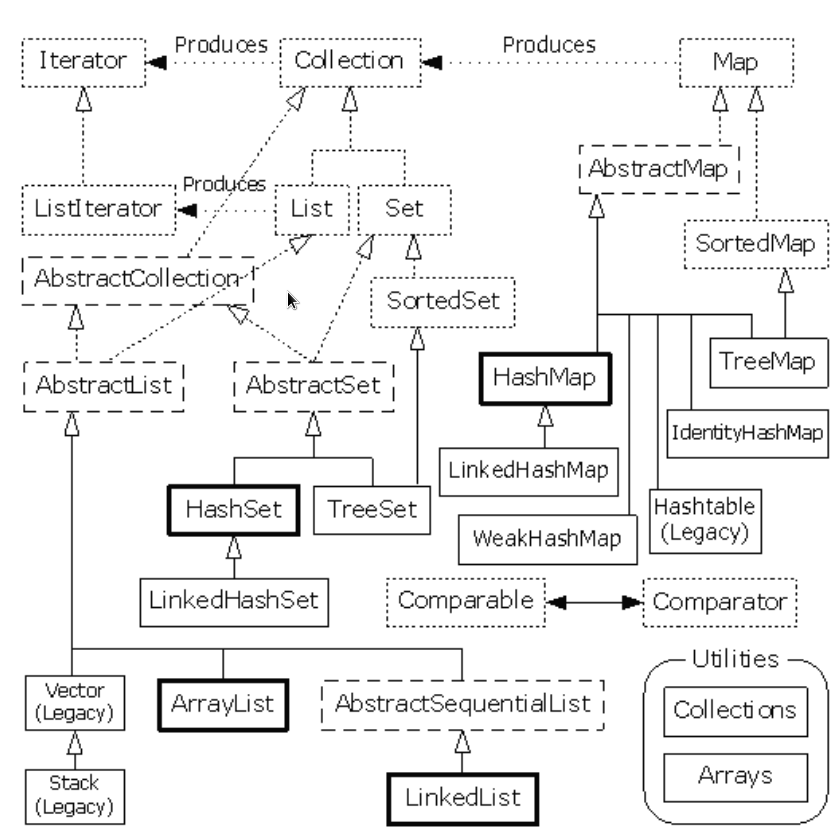

title: 常见的集合类概念和问题总结
date: 2016-05-18 21:27:32
tags:
- java
- 基础
- 集合类
- List
- Map
categories:
- java
- 基础知识
---

### ArrayList的实现原理
1. ArrayList是基于数组的方式实现，无容量的限制；
2. ArrayList在插入元素时可能会扩容，删除元素并不会减少数组容量，大部分都是使用System.arraycopy进行深拷贝出新的对象数组；
3. 由于ArrayList是基于数组的方式实现，所以查询是O(1)复杂度；
4. 线程不安全。

### Vector的实现原理
1. Vector和ArrayList的实现方式一样，只是关键方法都添加Synchronize的关键字来保证线程安全；
2. 容量扩展上和ArrayList不同，可以再初始化创建Vector时，传入增长值来控制每次扩展大小；
3. 线程安全的，由于锁的机制，操作耗费性能较大。

### LinkedList的实现原理
1. LinkedList是基于双向链表实现的；
2. 创建对象后，默认插入首位，只需要更改位置的前后指针就可以完成插入操作；
3. 查找元素时，遍历整个链表；
3. 删除元素时，遍历链表查找到元素后，更改前后元素指针，删除链表上的元素；
4. 线程不安全。

### Stack的实现原理
1. 继承于Vector类，额外实现了pop()、push()、peek()的方法；
2. 支持后进先出(LIFO)；
3. 线程安全的。

### ArrayList的大小是如何自动增加的
1. ArrayList在进行add操作时会对大小进行判断，如果不够大，会增长50%；
2. 如果容量不足时，ArrayList执行add方法的过程时，新建一个长度更长的数组，使用System.arraycopy()方法将旧数组拷贝到新数组。
> System.arraycopy()方法为浅拷贝，只是指针的引用。

### ArrayList初始化创建赋值方式
1. 无参创建：创建一个空数组填充的ArrayList，长度为0；
2. 根据size大小创建：根据传入数字，创建大小一样的数组；
3. 根据Collection对象创建：根据传入Collection对象的toArray()返回结果判断size，并将Collection的toArray()返回值，使用Arrays.copyOf方法赋值；
4. 初始创建的空ArrayList对象会在第一次add方法调用的时候，使用默认大小10进行数组创建。

### 如何复制某个ArrayList到另一个ArrayList
1. 使用clone方法：ArrayList newArray = oldArray.clone();
2. 使用ArrayList构造方法：ArrayList myObject = new ArrayList(myTempObject);
3. 使用Collection的copy方法
> 第3种为深拷贝，其他为浅拷贝

### 评估ArrayList的增加或者删除效率低的原因，如何改善？
删除和添加都是依赖于System.arraycopy()方法，所以效率比较低。 
改善：使用LinkedList进行频繁的添加和删除操作。

### ArrayList和LinkedList的区别

### ArrayList和Vector的区别

### ListIterator和Iterator的区别

### ConcurrentHashMap的实现原理

### HashMap的实现原理
1. 采用数组方式存储key和value构成的Entry对象，无容量限制；
2. 基于key的hash寻找在Entry数组中的位置，对于hash冲突采用链表方式处理；
3. HashMap进行元素添加的时候，先查找是否已存在，如果已存在就覆盖旧的value，并返回就得value，如果不存在，添加新的Entry对象；
4. HashMap在添加元素时，如果空间不够，自动扩展空间，扩展操作会创建新的Entry数组，并将老的Entry数组拷贝到新的数组中；
5. 线程不安全。

Java集合类的关系图谱如下所示：

