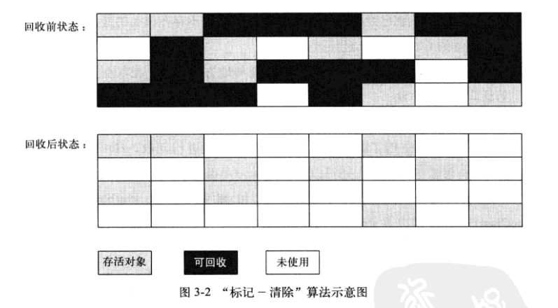
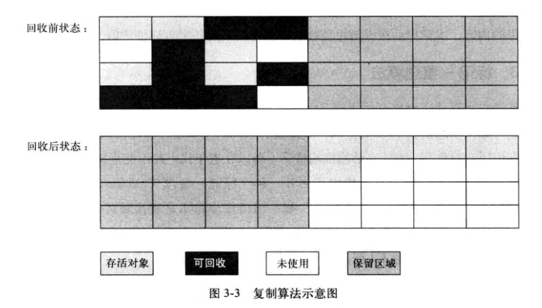
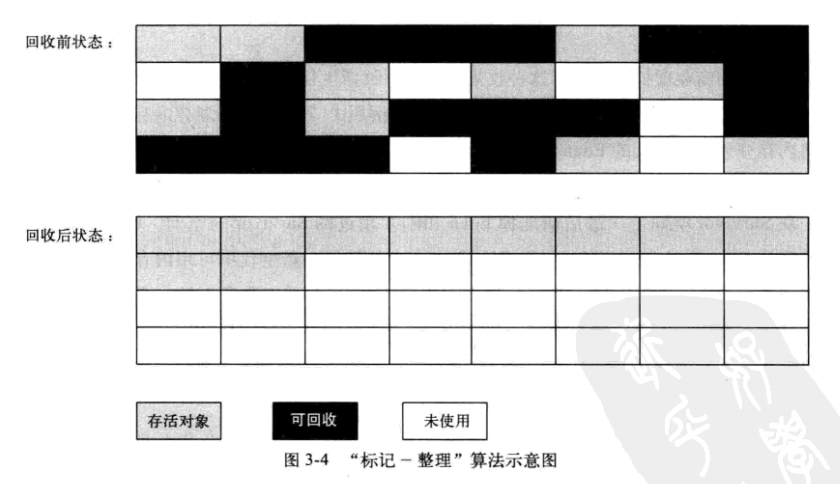

title: JVM虚拟机GC回收算法
date: 2016-04-27 15:12:34
tags:
- java
- JVM
- 基础
categories:
- java
- 基础知识
---

## JVM垃圾收集算法 

> 由于大多数虚拟机实现的细节不同，主要有4种垃圾收集算法：标记-清除算法、复制算法、标记-整理算法和分代收集算法。其中标记-清除为基础算法，复制算法和标记-整理算法都是基于该算法衍生而出，分代收集算法则是之前3种算法的整合。

### 标记-清除算法[Mark-Sweep]

概念：内存中标记需要回收的内存空间，在标记完成后统一回收掉全部标记的内存空间，从而使得对象回收完成。 

>算法操作流程：标记 -> 删除 

__算法缺点:__
- 效率问题：标记和清除的操作过程，效率都比较低。
- 空间问题：清除后会产生大量不连续的内存碎片，导致大对象无可用的连续内存。

示意图如下：

### 复制算法[Copying]

可用内存划分为大小相等的两部分，当内存用完后，将存活对象所占用的内存空间复制到另外一半中，然后回收掉用完的一半。

__算法优点:__
- 只需要移动堆顶的指针就可以完成内存的切换，运行高效
- 无内存碎片问题

__算法缺点：__
- 内存只使用一半，浪费较大

> 扩展：HotSpot虚拟机针对新生代的回收方式为复制算法的变体，由于**新生代对象存活时间短**的特点，HotSpot将内存划分为3部分，Eden:Survivor:Survivor=8:1:1，每次对象创建在Eden中创建，当GC发生时，将Eden和Survivor中存活对象所占空间复制到另外的Survivor中，从而完成新生代的回收。 PS：不能保证每次存活的对象都控制在10%以内，超出部分通过分配担保进行内存空间分配存储。

示意图如下：

### 标记-整理算法[Mark-Compact]

针对老年代的特点，让所有存活的对象向一端移动，清理边界以外的全部内存空间。

示意图如下：

### 分代收集算法[Generational Collection]

根据存活周期不同将内存划分多块，然后针对不同不同周期（年代）对象使用不同的，最应当的垃圾回收算法。
> java堆中划分为新生代和老年代，针对新生代(每次垃圾回收，有大批对象死亡，)使用Copying算法，而针对老年代使用Mark-Compact算法。

